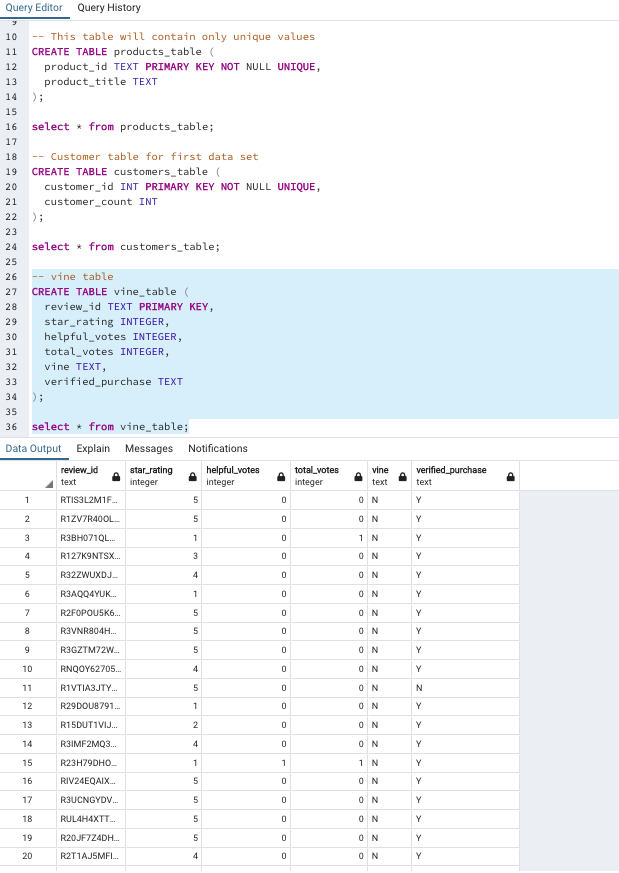

# Amazon_Vine_Analysis
- In this project, a complete ETL process has been performed in the AWS cloud platform and uploaded DataFrame to an AWS RDS instance. PySpark has been used to perform a statistical analysis of reviews of electronics items sold on Amazon.
- Analyzing Amazon reviews written by members of the paid Amazon Vine program.

## Overview
The purpose of the project is to analyze Amazon reviews written by members of the paid Amazon Vine program. In order to complete this analysis, I used a subset of data that pertained to the video game subcategory of Amazon. I then performed an ETL on this data by using AWS, Google Colaboratory, PostgreSQL, and PySpark. After taking closer look at one of the tables I made during the ETL phase regarding the vine reviews to determine if there was any positivity bias for reviews in the Vine Program.

### Results
During this analysis I wanted to answer a few key questions.

  1. How many Vine reviews and non-Vine reviews were there?
     - There are 94 vine reviews and 40,471 non-vine reviews for a total of 40,565 reviews.
total_reviews.

  2. How many Vine reviews were 5 stars_rating? How many non-Vine reviews were 5 stars_rating?
     - There were 48 5-star vine reviews and 15663 5-star non-vine reviews for a total of 15,711 5-star reviews.
5_star_reviews.

  3. What percentage of Vine reviews were 5 stars? What percentage of non-Vine reviews were 5 stars?
     - 51.06% of paid reviews are 5-stars and 38.7% of unpaid reveiws are 5-stars.
percentage_5_stars.

Below are the Results from SQL Queries:

## Summary
After looking that the results, I would conclude that there is a positivity bias for reviews in the Vine program:
- It is important to note that while the non-vine sample size was very large, the vine sample size was less than 100 entries. 
- While 94 entires is still a decent number to sample with, it could lead a less signifcant result. 
- In addition to the current analysis, I could take it a step further and see the percentage of those who purchased the product by filtering through the verified_purchase column to either confirm or fail to confirm if there is a positivity bias for reviews in the Vine program.
